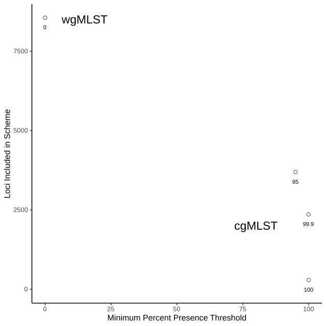

# Analysis

Here we created a core genome multilocus sequence typing scheme from _Salmonella enterica_ subspecies _enterica_ serovar Heidelberg using chewBBACA [1].
We used chewBBACA version 2.0.10 to perform this analysis. First, we generated a pangeomic whole genome multilocus sequence typing scheme (wgMLST). From this, we then extracted the cgMLST scheme by selecting those loci which were present in at least 99.9% of samples. This threshold was selected to stringently identify those genomic loci which were biologically present in all genomes, while allowing a small degree of leniency for loci absent due to technical noise. 

# Dataset 

To generate this cgMLST scheme, we used a collection of 4509 _Salmonella_ Heidelberg genome assemblies. 

# Results

The pangenomic analysis identified 8558 loci to be used in the wgMLST scheme. Of these, 2358 were core loci and included in the cgMLST scheme. If the threshold for inclusion in the core genome is tightened to 100%, the number of core loci falls to 290, and if it is relaxed to 95%, it expands to 3690.

## Reference
[1] https://github.com/B-UMMI/chewBBACA
